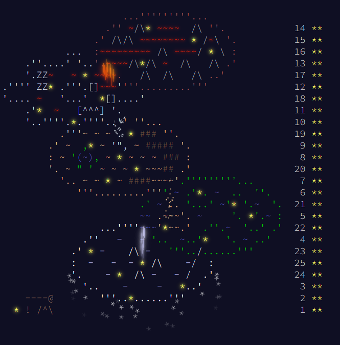

# AdventOfCode2023
A series of challenges in the spirit of the holidays for 2023 🎄

All of these solutions will be written in Python with the following goals in mind:
1. __Efficiency,__ where an efficient algorithm will do the job without over-killing the problem. I am aiming for a cumulative sub-15 seconds using plain Python 3.10 (no pypy) for these tasks.
2. __Organization.__ Avoid duplicate code for better readability and modularity. No 🍝 code!
3. __Keep it simple!__

I'm doing an internship on the west coast this year, so my sleep isn't ruined! I'll try to get on the global leaderboard, but every year I have less time to both participate and practice. Hoping to take this year's advent less seriously. 

## Tasks

| Day | Name                               | Part 1 | Part 2 | Points        | Runtime (ms) |
| --- | :--------------------------------- |:------ |:------ | :------------ | :----------- |
| 1   | Trebuchet?!                        | 257th  | 637th  | 0             | 22           |
| 2   | Cube Conundrum                     | 331st  | 218th  | 0             | 2            |
| 3   | Gear Ratios                        | 20th   | 8th    | 81 + 93 = 174 | 9            |
| 4   | Scratchcards                       | 1115th | 480th  | 0             | 3            |
| 5   | If You Give A Seed A Fertilizer    | 1060th | 160th  | 0             | 6            |
| 6   | Wait for It                        | 189th  | 379th  | 0             | 1            |
| 7   | Camel Cards                        | 17th   | 59th   | 84 + 42 = 126 | 16           |
| 8   | Haunted Wasteland                  | 139th  | 53rd   | 48            | 24           |
| 9   | Mirage Maintenance                 | 74th   | 99th   | 27 + 2 = 29   | 5            |
| 10  | Pipe Maze                          | 135th  | 493rd  | 0             | 61           |
| 11  | Cosmic Expansion                   | 170th  | 76th   | 25            | 86           |
| 12  | Hot Springs                        | 901st  | 101st  | 0             | 380          |
| 13  | Point of Incidence                 | 97th   | 38th   | 4 + 63 = 67   | 10           |
| 14  | Parabolic Reflector Dish           | 134th  | 58th   | 43            | 842          |
| 15  | Lens Library                       | 519th  | 315th  | 0             | 5            |
| 16  | The Floor Will Be Lava             | 110th  | 80th   | 21            | 1044         |
| 17  | Clumsy Crucible                    | 84th   | 43rd   | 17 + 58 = 75  | 2093         |
| 18  | Lavaduct Lagoon                    | 18th   | 82nd   | 83 + 19 = 102 | 3            |
| 19  | Aplenty                            | 77th   | 44th   | 24 + 57 = 81  | 14           |
| 20  | Pulse Propagation                  | 226th  | 735th  | 0             | 193          |
| 21  | Step Counter                       | 41st   | 509th  | 60            | 85           |
| 22  | Sand Slabs                         | 284th  | 320th  | 0             | 3383         |
| 23  | A Long Walk                        | 17th   | 688th  | 84            | 605          |
| 24  | Never Tell Me The Odds             | 86th   | 209th  | 15            | 365          |
| 25  | Snowverload                        | 791st  | 685th  | 0             | 33           |

__Score:__ 950 points

__Rank:__ 64th

__Total runtime:__ 9290 milliseconds

## Calendar Art

  <i>Credits to Eric Wastl (the creator of AOC) for the amazing ASCII calendar art!</i>  
   

## Final Thoughts 

No personal best and getting less points from previous years :"D but this felt like the most consistent year and I have very few regrets. The only thing stopping me from getting points is typing concise python code and solving the harder problems, and both of these issues came from the lack of practice x(

This is my first year getting < 10 seconds cumulative code and I had a good time optimizing my solutions (Day 21 and 25 were particularly fun to optimize!). It also turns out doing it on the west coast was a lot more enjoyable than in the east coast, same for when there's no ongoing finals. Day 24 and 25 were doomed because I was flying back to Canada with no sleep.

Would love to do it again next year since it's the 10th AOC next year, but that would be on a school term with finals and internship job search :( see you next year!
